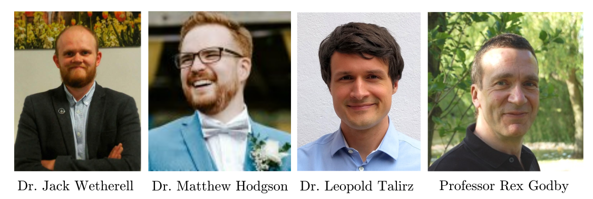

#  iDEA - The interacting Dynamic Electrons Approach


[](https://idea-interacting-dynamic-electrons-approach.readthedocs.io/en/latest/?badge=latest)


**iDEA (interacting Dynamic Electrons Approach) is a high-performance, user friendly, free software framework in python for state-of-the-art research, experiments, testing and education in many-body quantum physics with a focus on reproducability, interactivity and simplicity.**


The principle goal of the iDEA code is to improve the accuracy of approximations within fundamental theories of many-electron quantum mechanics. It has a central role in a number of research projects related to many-particle quantum mechanics for electrons in matter.

Some of iDEA's features:
- Exact solution of the many-electron problem by solving the static and time-dependent Schrödinger equation, including exact exchange and correlation.
- Exact solutions which approach the degree of exchange and correlation in realistic systems.
- Free choice of external potential that may be time-dependent, on an arbitrarilty dense spatial grid, for any number of electron with any spin configuration.
- Implementation of various approximate methods (established and novel) for comparison, including:
    - Non-interacting electrons
    - Hartree theory
    - Restricted and unrestricted Hartree-Fock
    - The Local Density Approximation (LDA)
    - Hybrid functionals
- Implementation of all common observables.
- Reverse-engineering to solve potential inversion, from exact Kohn-Sham DFT and beyond.
- Fully parallelised using OpenBLAS.
- Fully parallelised for all cuda supporting GPUS.

## Depenencies

iDEA supports `python 3.8+` along with the follwing dependences:
```
numpy >= "1.22.3"
scipy >= "1.8.0"
matplotlib >= "3.5.1"
jupyterlab >= "3.3.2"
tqdm >= "4.64.0"
```


## Installation

### User

To install the [latest version of the iDEA code](https://pypi.org/project/iDEA-latest/):

`pip install iDEA-latest`

To add iDEA to your poetry environment:

`poetry add iDEA-latest`

### Developer

If you would like to develop iDEA, first fork this git repository, and then clone from there.

Add the upstream repository: `git remote add upstream https://github.com/iDEA-org/iDEA.git`

And then install locally: `python setup.py install`

## Documentation

For full details of usage please see our [tutorial](https://github.com/iDEA-org/iDEA/blob/master/tutorial/tutorial.ipynb). The full API documentation is available at [readthedocs](https://idea-interacting-dynamic-electrons-approach.readthedocs.io/en/latest/).

## Example

In order to solve the Schrödinger equation for the two electron atom for the ground-state charge density and total energy:

```
import iDEA
system = iDEA.system.systems.atom
ground_state = iDEA.methods.interacting.solve(system, k=0)
n = iDEA.observables.density(system, state=ground_state)
E = ground_state.energy

import matplotlib.pyplot as plt
print(E)
plt.plot(system.x, n, 'k-')
plt.show()
```

## Tutorial

We provide a [tutorial](https://github.com/iDEA-org/iDEA/blob/master/tutorial/tutorial.ipynb) where you can learn how to use the iDEA code in your research and teaching projects.

## Papers You Can Reproduce With iDEA

1. Advantageous nearsightedness of many-body perturbation theory contrasted with Kohn-Sham density functional theory.
    [paper](https://journals.aps.org/prb/abstract/10.1103/PhysRevB.99.045129), [reprint](https://jackwetherell.github.io/files/nearsightedness.pdf), [preprint](https://arxiv.org/pdf/1812.02661.pdf), [code](https://github.com/JackWetherell/advantageous-nearsightedness).

More coming soon...

## Teaching

iDEA can also be used to create teaching content, visualisations and expositions> For example, see the following [YouTube video created using iDEA](https://www.youtube.com/watch?v=JaSVguMFA-M&ab_channel=JackWetherell).

## Developers



## Contributors

We thank all of the developers, PhD students, masters students, summer project interns and researchers for thier key contributions to iDEA:

Sean Adamson, Jacob Chapman, Thomas Durrant, Razak Elmaslmane, Mike Entwistle, Rex Godby, Matt Hodgson, Piers Lillystone, Aaron Long, Robbie Oliver, James Ramsden, Ewan Richardson, Matthew Smith, Leopold Talirz and Jack Wetherell. 

## Getting Involved

To get involved:
- Raising issues and pull requests here is greatly appreciated!
- We can add any papers that can be fully reproduced by iDEA to our dedicated page by sending your open access paper to jack.wetherell@gmail.com.
- We provide a [template](https://github.com/iDEA-org/iDEA-project-template) to get you started!